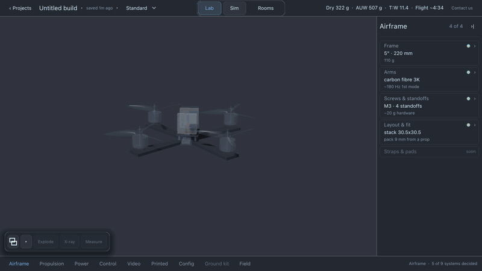

# Lothal

Build an FPV drone from real parts. Fly it. Feel the difference.



## What it does

Lothal is a drone design workbench and flight simulator. You assemble a
quadcopter from a catalog of real components — frames, motors, propellers, batteries —
and every choice changes the physics. Swap a 4S pack for 6S and the thrust-to-weight,
hover throttle, and flight time all recompute; then you fly it and feel the difference.

Nothing is a canned asset. Prop rotation is integrated from actual RPM, voltage sag is
computed from the pack's internal resistance and the current the motors are really
drawing, and the flight model runs at 1 kHz off measured manufacturer thrust data. The
simulation is the single source of truth: the HUD, the airframe you see, and the way it
flies are three views of one set of numbers.

Then fly the eight-gate circuit and see whether your build is actually faster.

## Run it

Requires [Godot 4.7+](https://godotengine.org/download).

```bash
git clone https://github.com/OneWeekendAI/lothal.git
cd lothal
godot project.godot
```

Press <kbd>F5</kbd> to run. A gamepad is strongly recommended.

### Controls

|                  | Gamepad             | Keyboard              |
| ---------------- | ------------------- | --------------------- |
| Roll / pitch     | Right stick         | Arrow keys            |
| Yaw              | Left stick ←→       | <kbd>A</kbd> <kbd>D</kbd> |
| Throttle         | Left stick ↑↓       | <kbd>W</kbd> <kbd>S</kbd> |
| Angle ↔ acro     | <kbd>A</kbd> button | <kbd>Space</kbd>      |
| Hide build panel | —                   | <kbd>Tab</kbd>        |

Keyboard input is digital, so it is a fallback for testing rather than a way to fly well.

### Lab and Sim

The app opens on **Lab** — the garage. Nothing flies there. You pick a frame, a motor and a
propeller from the catalog rails, and the airframe in the middle of the screen is generated
from those parts: arms as long as `arm_mm` says, motor bells the size of the stator, and
propeller blades twisted to the angle the pitch implies. The five derived stats and every
compatibility warning move with each change; there is no apply button.

The props turn — slowly, the way you flick one with a finger to check it runs true — and each
motor's rotor turns the way that motor really would, diagonals together and adjacents opposed.
A **Fit** panel carries the adjustments a builder actually makes to parts rather than choosing
between them: a shim under the prop, a soft-mount pad under the motor, taller or shorter
standoffs. Each slider's range comes from the parts fitted, so you can shim by as much spare
thread as that shaft has and no further, and your configuration is saved to `user://` and is
still there next time. Those are fit adjustments: they change what clears what, and they
deliberately do not move any flight number.

An **Electronics** rail carries the camera, the video transmitter, the antenna and the
receiver. Each of those was a share of a flat 55 g electronics budget until it became a part,
so the rail is where you find out what the payload is actually costing you — and every one of
them can be set to **Not fitted**, which is how you describe an AIO whoop that carries none of
the four. Taking one off makes the aircraft lighter by what that part really weighs and moves
the centre of mass by where it really sat. The same four dropdowns are on Sim's build panel, so
a bay you empty in the garage is empty in the field.

Because the render is built from the real dimensions, it doubles as the fit check. Put 7"
props on a 3" frame and you can see them intersect each other and the arms — the warning in
the panel and the picture are the same fact. Zoom in on a motor and the prop is on the shaft
above the bell, on its adapter, under its nut — with daylight you can see.

**Sim** is the field, reached through its tab. It flies exactly what Lab built, from the
same numbers: pick the 7" frame in the garage and the airframe in the field is a 7". The rotors
turn at the RPM the physics computed, per motor — and above a few hundred RPM they are drawn as
the disc they sweep rather than as blades, because discrete blades at flight speed alias into a
prop that appears to crawl, stop, or run backwards.

Fly through the lit gate. Gates must be taken in order; the eighth completes a lap, and
your best time is kept in `user://best_lap.json`. Hitting the ground puts you back at the
last gate you cleared and voids the lap in progress.

## Flight model

- Custom integrator at 1 kHz (8 substeps per 120 Hz frame), not Godot's rigid-body solver
- Inertia tensor assembled per build from part masses and positions via the parallel axis theorem
- Thrust and torque from `T = k_t · n²`, `Q = k_q · n²`, with `k_t` fit from the
  manufacturer thrust table the motor's headline figure was measured on, then rescaled to
  the prop actually fitted
- Pack voltage sags under load and sets the RPM ceiling, so a tired pack flies differently
- Motors are current-limited, so an oversized prop runs out of amps before it runs out of volts

Run the test suite headless — every check must pass, including the hover-throttle oracle
the whole model is calibrated against:

```bash
godot --headless --script res://tests/run_tests.gd
```

## Adding parts

The catalog is plain JSON in `data/parts/`, one file per category. Adding a real part is a
small, reviewable PR — that is exactly why it is JSON and not a binary format.

Every part has:

| Field      | Meaning                                                  |
| ---------- | -------------------------------------------------------- |
| `part_id`  | Unique key, referenced by other files. `motor_2207_1960kv` |
| `name`     | What shows in the dropdown. `2207 1960KV`                |
| `category` | `frame`, `motor`, `propeller`, or `battery`              |
| `mass_g`   | Real mass in grams — feeds the mass properties directly  |
| `source`   | Where the numbers came from. Required; see below         |

Then the per-category `specs`:

**`frames.json`** — physics-bearing fields live in `specs`: `arm_mm` (centre to motor, and
the sleeper spec: roll inertia goes as arm², so it dominates how the build feels),
`max_prop_inches`, `motor_mount` (e.g. `16x16`). Alongside `specs`, a sibling `catalog`
block holds browsing metadata that does not feed the physics but is needed to navigate a
growing catalog: `frame_type` (e.g. `freestyle`, `racing`, `cinelifter`), `size_class` (the
prop class the frame is built around, e.g. `5"`, `65mm`), and `material` (e.g. `carbon
fibre 3K`).

Every category can grow a `catalog` block the same way: `specs` stays the physics contract
and is unchanged by this; `catalog` is where a new field goes if it is a real, checkable
fact about the product and it earns its place by making the catalog easier to browse at
scale, not by describing the physics.

**`motors.json`** — `kv`, `stator_diameter_mm`, `stator_height_mm`, `max_thrust_g`,
`max_amps`, `poles`. Plus a `mount_pattern` and a `thrust_test` block naming the
`prop_id` and `voltage_v` the headline thrust figure was measured with. That block is not
optional: a thrust number without the prop and pack behind it cannot be turned into a
coefficient, and a guessed coefficient is the one thing this project will not ship. The
`prop_id` must name a propeller that actually exists — the test suite checks it, because a
typo there does not make the drone slightly wrong, it fits a coefficient against nothing.
The `catalog` block holds `stator_class` (e.g. `22xx`), `kv_class`, and `intended_use`.

**`propellers.json`** — `diameter_inches`, `pitch_inches`, `blades`. Thrust goes as
diameter⁴ and shaft torque as diameter⁵, so diameter dominates everything else here. Pitch
also sets the blade angle the generated mesh is twisted to, so it is visible as well as
felt. The `catalog` block holds `blade_count`, `diameter_class`, `intended_use`, and
`material` — material is browsing metadata rather than a spec because nothing reads it yet;
the day the model grows a blade-flex term is the day it moves into `specs`.

**`batteries.json`** — `cells`, `nominal_v`, `mah`, `internal_r_ohm`. Internal resistance
is what makes a pack feel strong or tired; it is worth finding a real figure rather than
copying a neighbouring entry.

Two rules for a part PR:

1. **Every spec must come from a real product**, and `source` must say where — a
   manufacturer thrust table, a spec sheet, a bench test. Plausible-looking invented
   numbers are worse than a missing part, because they quietly corrupt the comparison
   between two builds, which is the entire point of the tool.
2. **If a field feeds the physics, it goes in `specs`, and that bar is unchanged.** If it
   is browsing metadata — a real, checkable property of the product needed to navigate the
   catalog, such as frame type, size class, or material — it goes in `catalog` instead.
   Colour, price, and vendor links are not admissible in either block.

Incompatible combinations are allowed on purpose. Putting 7" props on a 3" frame warns and
then shows you what happens, because that answer teaches more than a greyed-out dropdown.

## Not in this release

Procedural audio, Betaflight SITL, drag-and-drop assembly, damage modelling, propwash and
ground effect. The observables the flight model publishes (per-motor RPM, live pack
voltage, blade-pass frequency) are what those consumers would be built on, and the
architecture is arranged so that adding one touches no physics code.

## Tech stack

- **Godot 4.7** (GDScript) — engine, UI, rendering
- **Custom 1 kHz flight dynamics** — own integrator, not the rigid-body solver
- **Jolt** — collision queries only

## Project Statistics

<!-- CLOC-START -->
```
github.com/AlDanial/cloc v 2.10  T=0.47 s (714.5 files/s, 235957.7 lines/s)
-------------------------------------------------------------------------------
Language                     files          blank        comment           code
-------------------------------------------------------------------------------
JSON                            20              0              0          42366
GDScript                       277           8912          19125          34776
Bourne Shell                     7            117            296            622
Rust                             8             85            233            613
Python                           2            125            283            382
Markdown                         2             91              4            306
TypeScript                       3             50             91            264
XML                              3              3              0            233
YAML                             2             31             75            188
TOML                             3             57            246            164
Godot Scene                      2             17             10             57
JavaScript                       1             14             47             57
SVG                              1              0              5             27
Text                             2              0              0              5
-------------------------------------------------------------------------------
SUM:                           333           9502          20415          80060
-------------------------------------------------------------------------------
```

<!-- CLOC-END -->

## License

© 2026 Meetdev. All rights reserved. See [NOTICE](NOTICE).

Lothal is proprietary. This repository is private and its source is not licensed for use,
copying, modification or redistribution. The public distribution repo is
[lothal-public](https://github.com/OneWeekendAI/lothal-public), which carries the binaries and
documentation only.
